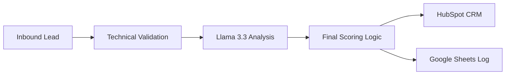

# 🎯 Enterprise AI Lead Scoring & Qualification System

> **Reference Architecture:** An automated lead processing pipeline that combines technical validation with LLM-based intent analysis (Llama 3.3) to prioritize sales efforts.

---

## 💡 The Business Problem: Sales Team Overload

Sales departments often waste their time on low-quality leads or spam. This system acts as an **Automated Gatekeeper**, ensuring that only high-intent, validated leads reach the CRM (HubSpot), while technical data is cleansed and enriched in the background.

---

## 🛠️ System Architecture

The workflow follows a 3-stage qualification process:

1. **Technical Validation:** Cleans phone numbers, validates email domains, and checks if the lead is using a corporate or free (Gmail/WP) email.
2. **AI Intent Analysis:** Uses **Llama 3.3 (via Groq)** to analyze the message content, identify the industry, and assign an intent score (HOT/WARM/COLD).
3. **CRM Orchestration:** Aggregates scores and automatically routes the lead to **HubSpot** and **Google Sheets** with appropriate prioritization labels.

---

## 🧠 Engineering Challenges & Solutions

### 1. Data Sanitization & Phone Normalization
**Problem:** Inbound leads often provide phone numbers in inconsistent formats (with prefixes, spaces, or dashes), which causes synchronization errors in CRM systems like HubSpot.  
**Solution:** Built a custom JavaScript processing engine that uses Regex to strip non-numeric characters and normalize international prefixes. This ensures a clean, 9-digit format that is 100% compatible with standard CRM database schemas.

### 2. Intent Detection via Llama 3.3 (The "Context" Problem)
**Problem:** Simple keyword-based filters often misclassify leads (e.g., a user asking "how to cancel" vs "how to buy a license").  
**Solution:** Implemented a sophisticated system prompt for **Llama 3.3 (70B)** that performs qualitative analysis. The model evaluates the "psychological intent" behind the message and assigns an AI-Score based on buying signals, urgency, and professional depth.

### 3. CRM Hygiene & Lead Prioritization
**Problem:** Sales teams are often overwhelmed by "noise" (low-quality leads and spam), leading to missed opportunities with high-value prospects.  
**Solution:** Developed a weighted scoring matrix. Only leads that achieve a **Total Score > 60** are tagged as **🔥 HOT LEAD**. The system automatically updates the "Job Title" field in HubSpot with the Lead Status and detected Industry, allowing sales reps to filter and react to the best opportunities in minutes.

---

## 📂 Repository Structure

*   `workflow_sanitized.json`: The complete n8n workflow file, ready for import. All sensitive IDs and credentials have been replaced with placeholders.
*   `scoring_logic.js`: A standalone JavaScript file containing the core sanitization and score aggregation logic used in the Node.js nodes.

---

## 🤝 Transparency: Human vs. AI Role

*   **My Role (Architect):** Defined the lead qualification criteria (Scorecard), designed the multi-stage logic flow, and managed the HubSpot CRM data mapping.
*   **AI Role:** Assisted in fine-tuning the Llama 3.3 system prompt for better classification accuracy and provided boilerplate code for the JavaScript regex normalization.

---

## 🚀 Deployment Requirements

*   **Orchestrator:** n8n (Self-hosted or Cloud)
*   **Inference Engine:** Groq Cloud API (Llama-3.3-70b-versatile)
*   **CRM Integration:** HubSpot (App Token with Contacts Scopes)
*   **Storage:** Google Sheets API
